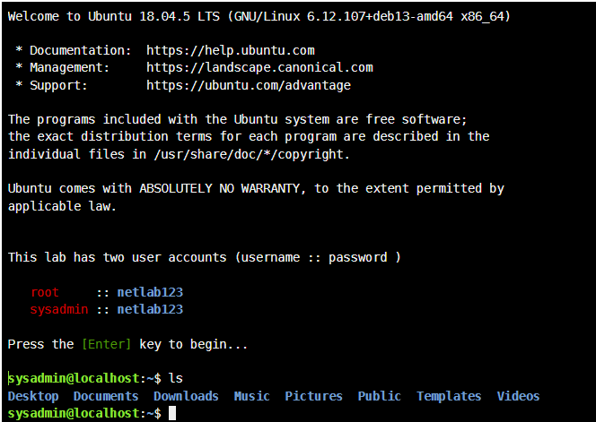
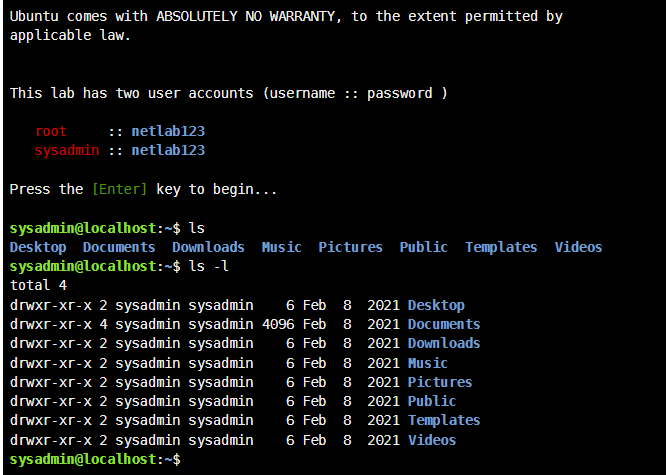
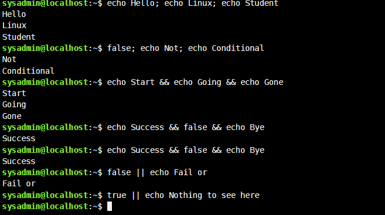
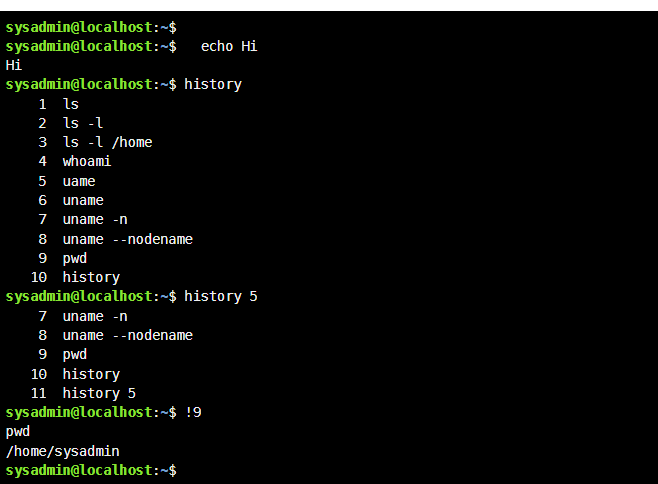
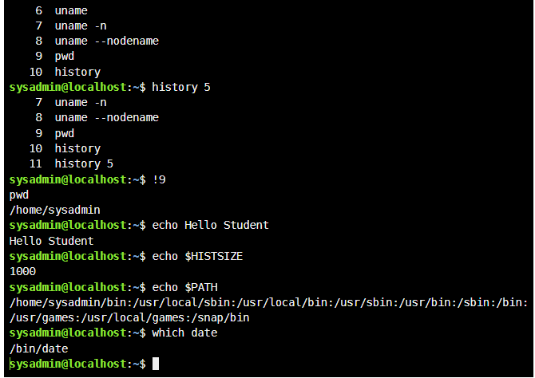
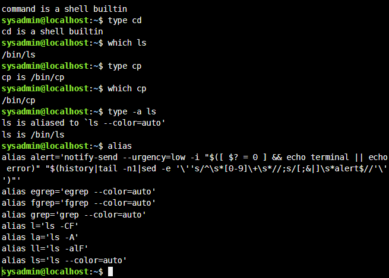
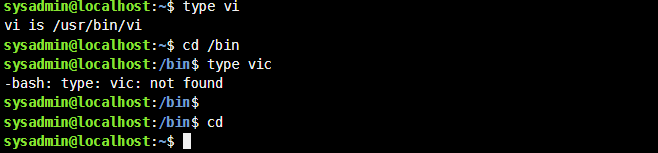
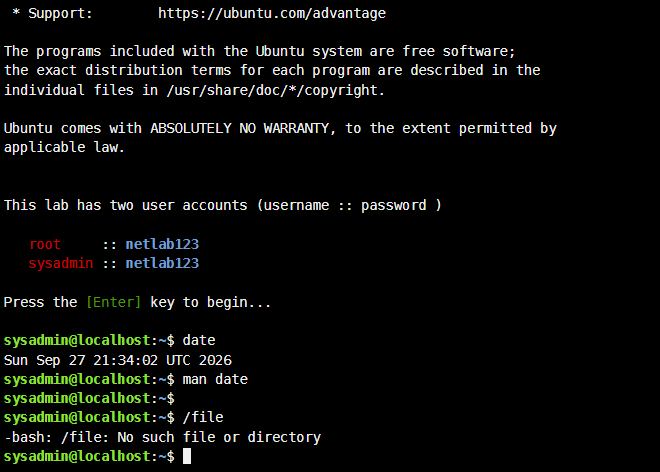
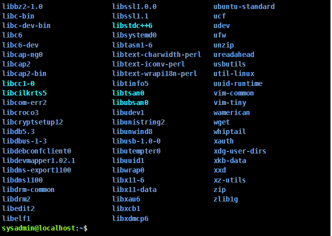
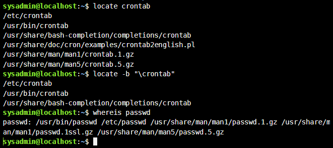

# NetAcad Linux Course — Modules 5 & 6 Writeup

**Modules covered:** Module 5 — Command Line Skills · Module 6 — Getting Help
**Environment:** Ubuntu 18.04.5 LTS, logged in as `sysadmin`

---

## Module 5: Command Line Skills

### 1. Logging In and Basic Navigation



```bash
ls
```
Lists the contents of the current directory (home folder) — showed the standard set of folders: Desktop, Documents, Downloads, Music, Pictures, Public, Templates, Videos.



```bash
ls -l
```
Lists contents in "long format," showing permissions, ownership, size, and modification date for each item. Useful for checking who owns a file and what access rights are set.

### 2. Command Chaining and Conditional Execution



```bash
echo Hello; echo Linux; echo Student
```
The semicolon (`;`) runs commands **sequentially**, regardless of whether the previous one succeeded or failed.

```bash
false; echo Not; echo Conditional
```
`false` always "fails" (exit status 1), but since `;` doesn't care about success/failure, both echoes still run.

```bash
echo Start && echo Going && echo Gone
```
`&&` only runs the next command **if the previous one succeeded** (exit status 0). Since `echo` always succeeds, all three ran.

```bash
echo Success && false && echo Bye
```
Here, `echo Success` succeeds, but `false` fails — so the chain stops and `echo Bye` never runs. This is why the output only shows "Success."

```bash
false || echo Fail or
```
`||` runs the next command **only if the previous one failed**. Since `false` fails, "Fail or" prints.

```bash
true || echo Nothing to see here
```
Since `true` succeeds, the `||` condition isn't triggered, so nothing after it runs.

**Key takeaway:** `;` chains unconditionally, `&&` chains on success, `||` chains on failure. This is the backbone of writing conditional logic directly at the command line or in shell scripts.

### 3. Command History




```bash
history
```
Displays a numbered list of previously run commands in the session.

```bash
history 5
```
Shows only the last 5 commands from history — useful for quickly reviewing recent activity without scrolling through the whole log.

```bash
!9
```
Re-runs command number 9 from the history list (in my case, `pwd`) — a fast way to repeat a command without retyping it.

```bash
echo $HISTSIZE
```
Prints the number of commands the shell keeps in history (1000 in this case) — an environment variable controlling history length.

### 4. Environment Variables and Locating Commands

```bash
echo $PATH
```
Displays the list of directories the shell searches through (in order) when you type a command name, separated by colons. This is why typing `ls` works from anywhere — `/bin` is in the PATH.

```bash
which date
```
Shows the full path to the executable that would run if you typed `date` — in this case `/bin/date`. Useful for confirming exactly which version of a program will execute, especially if multiple versions exist on a system.

### 5. Distinguishing Shell Builtins from External Commands




```bash
type cd
```
Reports that `cd` is a shell **builtin** — implemented directly in the shell itself, not a separate program file. This makes sense since `cd` needs to change the shell's own working directory, which an external program couldn't do.

```bash
which ls
type cp
which cp
```
`ls` and `cp` are external programs located at `/bin/ls` and `/bin/cp`, unlike `cd`.

```bash
type -a ls
```
Shows *all* the ways `ls` could resolve — here, it revealed `ls` is aliased to `ls --color=auto`, and that alias itself points to the binary at `/bin/ls`. This explains why directory listings appear in colour by default.

```bash
alias
```
Lists all currently defined aliases on the system — shortcuts like `ll='ls -alF'` and `la='ls -A'` that save typing for commonly used command variations.

```bash
type vi
```
Confirms `vi` is located at `/usr/bin/vi`.

```bash
type vic
```
Returns "not found" — demonstrating that `type` (and the shell generally) only recognises exact command names; a typo or non-existent command produces a clear error rather than guessing.

```bash
cd
```
Running `cd` with no arguments returns you to your home directory — a quick shortcut instead of typing the full path.

### Module 5 — Challenges & Key Takeaways

- The distinction between `&&` and `||` took a moment to internalise — the clearest way to remember it: `&&` = "and it worked, so continue," `||` = "or if it didn't, do this instead."
- Understanding that `ls` is aliased (not just a plain binary) explained behaviour I'd taken for granted, like automatic colour-coding in directory listings.
- `type` and `which` seem similar but serve different purposes: `which` only finds external executables in your PATH, while `type` also identifies builtins and aliases — so `type` is the more complete diagnostic tool.

---

## Module 6: Getting Help

### 1. Checking the System Date and Manual Pages



```bash
date
```
Displays the current system date and time — useful for logging, timestamping, and scheduling tasks.

```bash
man date
```
Opens the manual page for the `date` command, showing its syntax, available options (e.g., custom formatting), and usage examples. This is the primary built-in reference tool in Linux — nearly every command has a corresponding `man` page.

```bash
/file
```
Attempting to run `/file` directly (not a real command or path) returned `-bash: /file: No such file or directory` — a reminder that Bash tries to execute exactly what you type; if it's not a valid path to an executable, it fails clearly rather than guessing your intent.



### 2. Finding Files and Commands with `locate` and `whereis`



```bash
locate crontab
```
Searches a prebuilt index of the filesystem for anything with "crontab" in its name — much faster than `find` since it doesn't scan the disk live. It returned the crontab config file, binary, man pages, and related docs.

```bash
locate -b "\crontab"
```
The `-b` flag restricts the search to the **basename only** (the file's own name, not its full path), and the backslash forces an exact match rather than a partial one. This narrows results to files literally named `crontab`.

```bash
whereis passwd
```
Locates the binary, source, and manual page files associated with a command — here showing `/usr/bin/passwd` (the executable) plus its various man page locations. Unlike `which`, `whereis` also finds documentation, not just the executable.

### Module 6 — Challenges & Key Takeaways

- When you don't know exactly where something lives, `locate` is fast for filename searches (via its index), `whereis` is best for finding a command's binary *and* its docs together, and `man` is where you go once you've found the right command and need to know how to use it.
- Trying to "run" a path that isn't an executable (`/file`) was a useful reminder that Bash doesn't guess intent — it fails immediately and clearly, which is actually helpful for troubleshooting once you know how to read the error.

---

## Overall Reflection

Across both modules, the biggest takeaway was how much Linux relies on layered "help" mechanisms — `man`, `--help`, `type`, `which`, `locate`, `whereis` — each suited to a different stage of figuring out what a command does or where it lives. Building fluency here directly supports troubleshooting and scripting work in a cloud/DevOps context, where I won't always have a GUI to fall back on.
